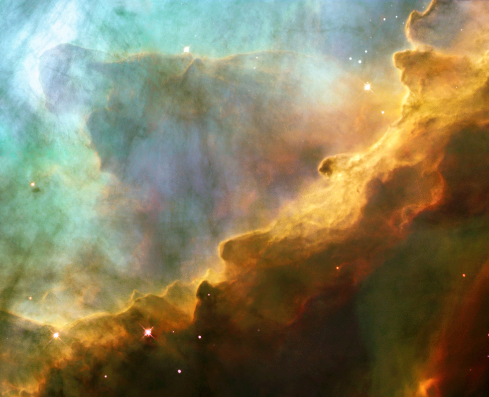

A card is a component

### Preview

    
    

        

            

                
            

            

                <h6 class="card-title">Card title</h6>
            

        

    

### Code


    
    

        

            

                
            

            

                <h6 class="card-title">Card title</h6>
            

        

    


